# UPSPack V3P Firmware upgrade tutorial

The upgrade method mentioned in this article is only applicable to the hardware of UPSPack Standard V3P version (**not applicable to V3 or older hardware version**).

This article is the entire process of doing a fresh configuration after installing from a fresh Raspberry Pi OS system.


### Software upgrade steps

#### Correctly configure the RPi serial port and other previous work

1. Configure the UART serial port function, and after restarting, check the serial port correspondence

   

   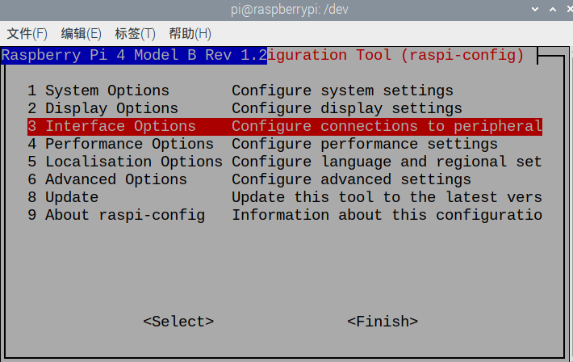

   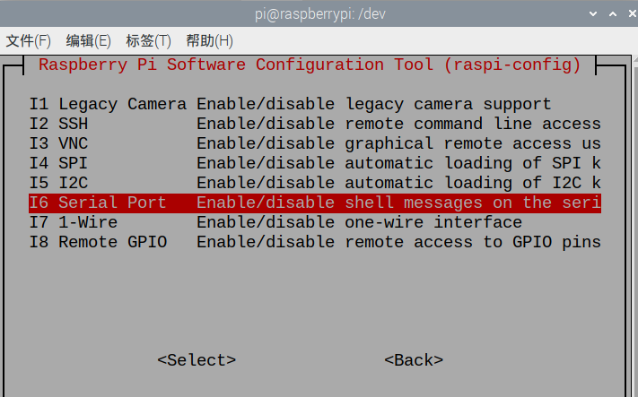

   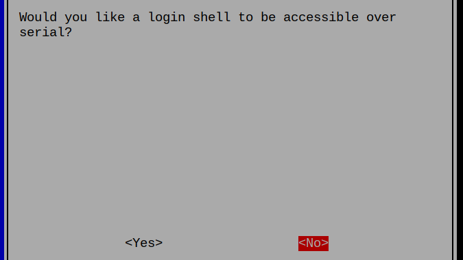

   

   

   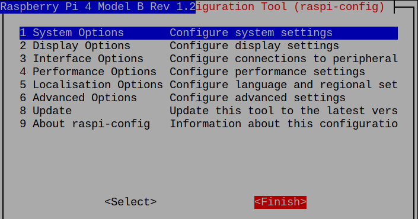

   

   

2. Install minicom software, execute `sudo apt-get install minicom -y`
   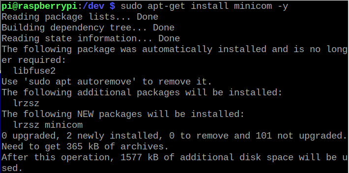

   
   
3. Connect the GND, TX, RX on the Pi with the GND, TX, RX on the UPS one-to-one through the DuPont line.
   Installation tips:
   

   * The UPS switch remains off (the switch is turned to the OFF position, and the Power LED is off)

   * First connect the 3 DuPont lines of the GPIO port of the Pi: GND (black), TX (yellow), RX (green)
     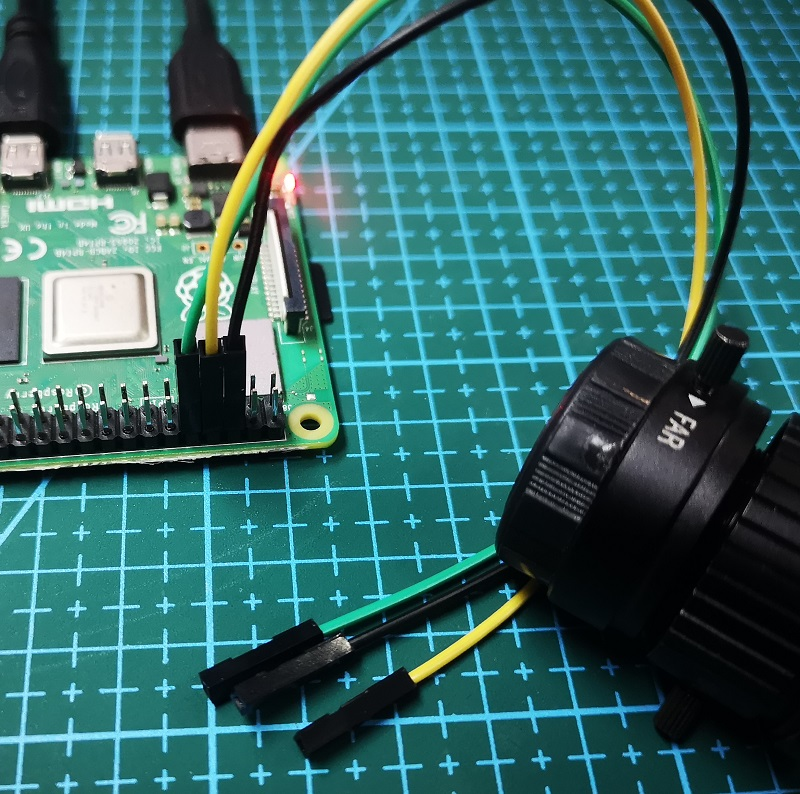

   * Then connect the 3 DuPont lines of the UPS motherboard: GND (black), TX (yellow), RX (green)

     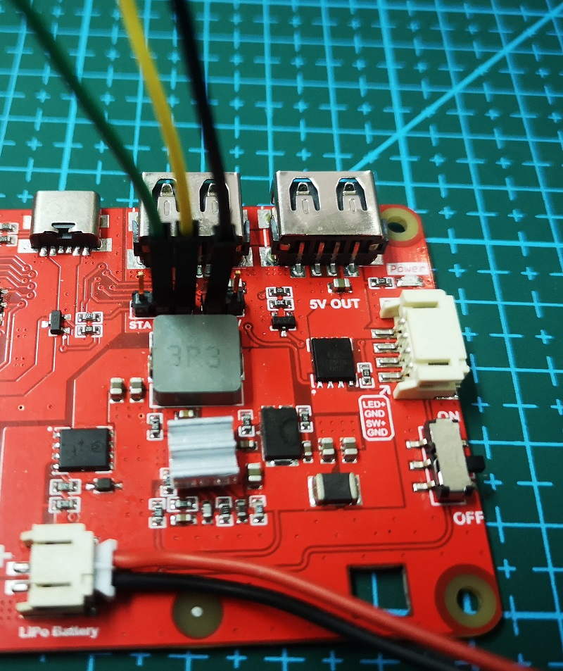
   
     
   
4. Execute `minicom -D /dev/serial0 -b 9600` to read the version number of the UPS
     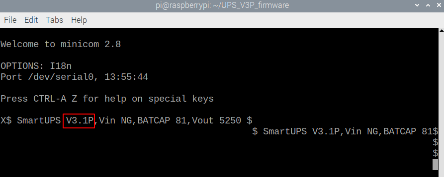

   **The way to exit minicom**: first press ctrl+a, then press the z key, and finally press the x key
     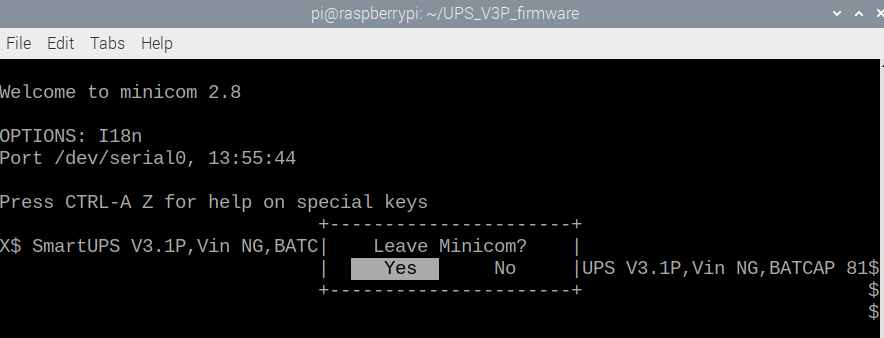

5. Turn off the power of the UPS, and unplug the 3 Dupont lines of GND, TX, and RX on the UPS. (**This step is very important, otherwise subsequent upgrades will fail**)
     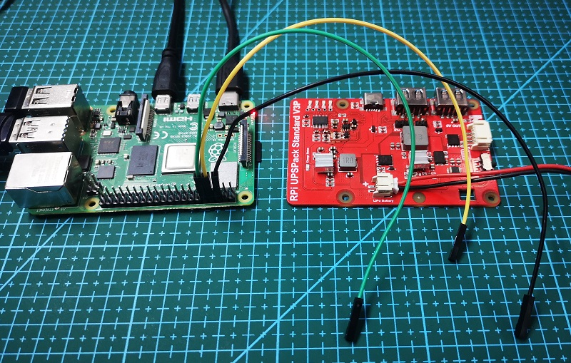


#### Start the upgrade

1. Download the upgrade program
   ````
   cd ~
   git clone https://github.com/rcdrones/UPS_V3P_firmware.git
   ````
   
   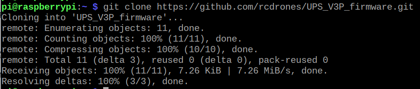
   
   
   
2. Enter the directory of the upgrade program and test the upgrade program

   ```shell
   cd UPS_V3P_firmware
   python3 ups_update_python3.py /dev/serial0 SmartUPS_V32P.bin
   ````

   

   If you see the above running effect, ctrl + c ends the running program
   
   

3. Insert the 3 DuPont cables into the GND, TX, and RX of the UPS mainboard. (**Pay attention to the line sequence, do not insert wrong, it will burn out**), keep the switch in the **off** state.
   

   
   
4. Run the upgrade program again. After seeing the sending command on the screen, turn on the switch of the UPS immediately and observe the prompt that the upgrade is successful.

   ```shell
   python3 ups_update_python3.py /dev/serial0 SmartUPS_V32P.bin
   ````
   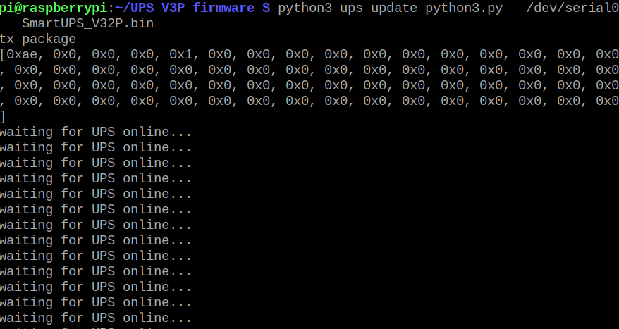

   After seeing **waiting for UPS online**, **turn on the UPS switch now**.

   

5. Turn off the power of the UPS, and unplug the 3 Dupont lines of GND, TX, and RX on the UPS. (**This step is very important, otherwise the next observation version will be wrong)
   


#### Observe the software version number:

1. Connect the GND, TX and RX of the UPS mainboard. (Pay attention to the line sequence. Don't insert it wrong, it may burn out!), keep the switch off.
   
2. Execute `minicom -D /dev/serial0 -b 9600` and turn on the UPS. Read the version number of the UPS
   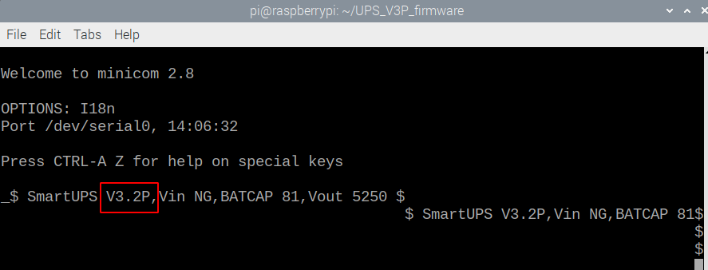

3. Turn off the UPS switch, unplug the DuPont cable between the UPS and the Pi, and the upgrade is complete.
   


### FAQ

1. Execute `minicom -D /dev/serial0 -b 9600` and observe garbled characters, why?
   Schematic diagram of garbled code:
   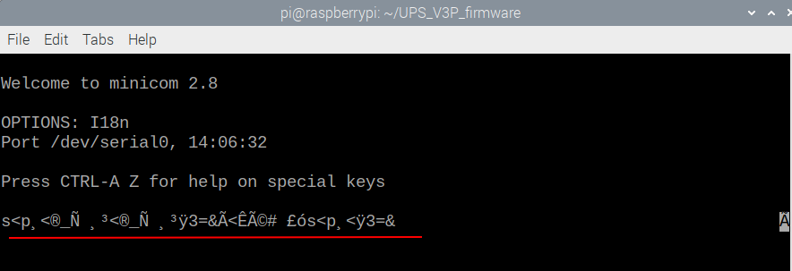

   Reason for explanation: Since the serial port on the Pi remains at a high level during idle time, a weak current will supply power to the MCU through the TX and RX signal lines, so the MCU resets abnormally, and the ISP upgrade method requires the MCU to perform a cold boot to enter Bootloader program. So you will see a string of garbled characters on minicom instead of readable ASCII codes.

   solution:

   * The UPS switch remains off (the switch is turned to the OFF position, and the Power LED is off)
   * Unplug the 3 DuPont lines of the UPS motherboard: GND (black), TX (yellow), RX (green)
     
     
   * Then connect the 3 DuPont lines of the UPS motherboard: GND (black), TX (yellow), RX (green)
     
     
   * Rerun `minicom -D /dev/serial0 -b 9600`. The way to exit minicom is: first press ctrl+a, then press the z key, and finally press the x key


 2. Execute `python3 ups_update_python3.py /dev/serial0 SmartUPS_V32P.bin`, the python interpreter reports an error (AttributeError: module serial has no attribute Serial), which shows that the Serial method in the serial class is not found.
    Explanation: Because the Raspberry Pi OS system version is frequently updated, some new versions of the python integration library are incompatible. Re-uninstall the system's own library, and reinstall the python library to solve it.
    solution:

    * Uninstall system libraries: `pip uninstall serial`
    * Reinstall the library: `pip install pyserial`
    * Execute `python3 ups_update_python3.py /dev/serial0 filename.bin` again
    * Or execute on a system with python2: `python2 ups_update_python2.py /dev/serial0 filename.bin`