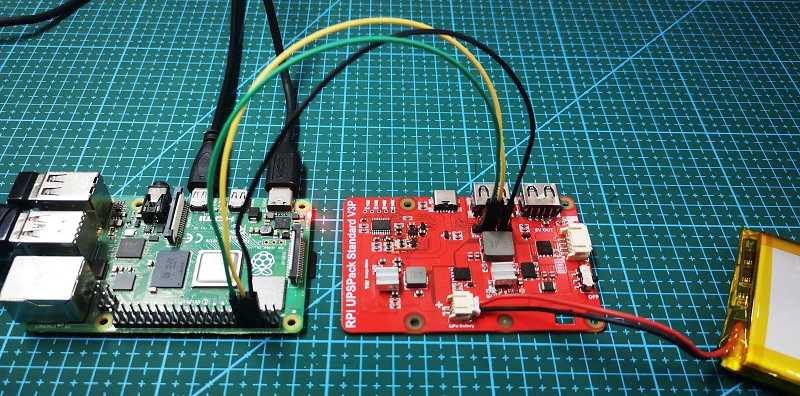

# UPSPack V3P 软件升级教程

本文涉及的升级方式，仅适用于UPSPack Standard V3P版本的硬件（**不适用于V3或者更老的硬件版本**）。

本文是从一个全新的Raspberry Pi OS系统安装后，进行全新配置的整个过程。


### 软件升级步骤

#### 正确配置RPi串口等前续工作

1. 配置UART串口功能，并重启后，查看串口对应关系

   

   

   

   

   

   

   

   

   

2. 安装minicom软件，执行`sudo apt-get install minicom -y`
   

   
   
3. 把Pi上的GND、TX、RX与UPS上的GND、TX、RX通过杜邦线进行一对一连接。
   安装技巧：
   

   * UPS开关保持为关闭状态（开关打到OFF档位，Power LED是熄灭的状态）

   * 先接上Pi的GPIO口的3条杜邦线：GND（黑色）、TX（黄色）、RX（绿色）
     

   * 然后接上UPS主板的3条杜邦线：GND（黑色）、TX（黄色）、RX（绿色）

     
  
     
   
4. 执行`minicom -D /dev/serial0 -b 9600`，读取UPS的版本号
     

   **退出minicom的方式**：先按ctrl+a，然后按z键，最后按x键
     

5. 关闭UPS电源，并且拔掉UPS上的GND、TX、RX，这3条杜邦线。（**这一步非常重要，否则后续升级将会失败**）
     


#### 开始升级

1. 下载升级程序   
   ```
   cd ~
   git clone https://github.com/rcdrones/UPS_V3P_firmware.git
   ```
   
   
   
   
   
2. 进入升级程序的目录，测试升级程序

   ```shell
   cd UPS_V3P_firmware
   python3 ups_update_python3.py   /dev/serial0   SmartUPS_V32P.bin
   ```

   

   如果看到上面的运行效果，ctrl + c结束运行的程序
   
   

3. 把3条杜邦线，插入UPS主板的GND、TX、RX。（**注意线序，不要插错，插错会烧毁**），保持开关为**关闭**状态。
   

   
   
4. 再次运行升级程序，看到屏幕有发送指令后，立刻打开UPS的开关，并观察升级成功的提示

   ```shell
   python3 ups_update_python3.py   /dev/serial0   SmartUPS_V32P.bin
   ```
   

   看到**waiting for UPS online**后，**此刻打开UPS的开关**。

   

5. 关闭UPS电源，并且拔掉UPS上的GND、TX、RX，这3条杜邦线。（**这一步非常重要，否则下一步观察版本将会出错）
   


#### 观察软件版本号：

1. 接上UPS主板的GND、TX、RX。（注意线序。不要插错，插错可能会烧毁！），保持开关为关闭状态。
   
2. 执行`minicom -D /dev/serial0 -b 9600`，并打开UPS的开关。读取UPS的版本号
   

3. 关闭UPS开关，拔除UPS和Pi之间的杜邦线，升级结束。
   


### 答疑解惑

1. 执行`minicom -D /dev/serial0 -b 9600`，观察到乱码，是为什么？
   乱码示意图：
   

   解释原因：由于Pi上串口在空闲时刻一直保持为高电平，微弱的电流会通过TX、RX信号线给MCU进行供电，所以导致MCU复位异常，而ISP升级方式是需要MCU进行冷启动才能进入Bootloader程序。所以在minicom上会看到一串乱码，而并不是可读的ASCII码。

   解决方案：

   * UPS开关保持为关闭状态（开关打到OFF档位，Power LED是熄灭的状态）
   * 拔掉UPS主板的3条杜邦线：GND（黑色）、TX（黄色）、RX（绿色）
     
     
   * 再接上UPS主板的3条杜邦线：GND（黑色）、TX（黄色）、RX（绿色）
     
     
   * 重新运行`minicom -D /dev/serial0 -b 9600`。退出minicom的方式是：先按ctrl+a，然后按z键，最后按x键


 2. 执行`python3 ups_update_python3.py   /dev/serial0   SmartUPS_V32P.bin`，python解释器报错（AttributeError: module serial has no attribute Serial），显示为未找到serial类中Serial的方法。
    解释原因：由于Raspberry Pi OS系统版本经常更新，某些新版本python集成库不兼容导致。重新卸载系统自带库，并且重新安装一下python库即可解决。
    解决方案：

    * 卸载系统库：`pip uninstall serial`
* 重新安装库：`pip install pyserial`
    * 再次执行`python3 ups_update_python3.py   /dev/serial0   filename.bin` 
* 或者在自带python2的系统上执行：`python2   ups_update_python2.py   /dev/serial0   filename.bin` 
    


​      


​    


